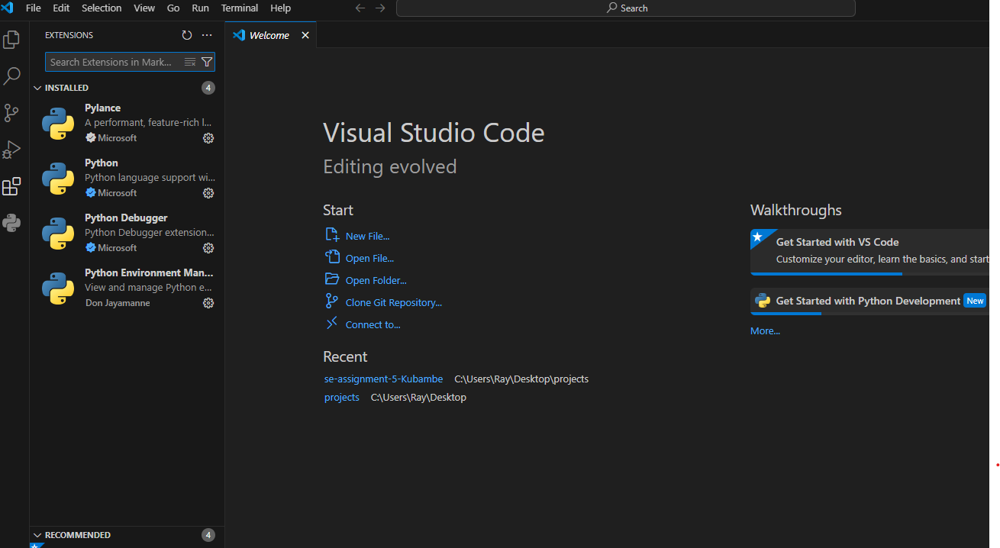

# SE-Assignment-5
Installation and Navigation of Visual Studio Code (VS Code)
 Instructions:
Answer the following questions based on your understanding of the installation and navigation of Visual Studio Code (VS Code). Provide detailed explanations and examples where appropriate.

 Questions:

1. Installation of VS Code:
   - Describe the steps to download and install Visual Studio Code on Windows 11 operating system. Include any prerequisites that might be needed.
   Open your web browser and go to the Visual Studio Code website(https://code.visualstudio.com/).
   
   Click on the Download for Windows button.
   
   Once the download is complete, open the downloaded file (VSCodeSetup.exe).
     
   Follow the prompts in the setup wizard and accept the license agreement and choose the installation location.
   
   Choose additional tasks such as creating a desktop icon, adding VS Code to the PATH and enabling options for opening files with VS Code.
   Click Install. After installation, click Finish to launch VS Code.
   

2. First-time Setup:
   - After installing VS Code, what initial configurations and settings should be adjusted for an optimal coding environment? Mention any important settings or extensions.
   Initial Configurations and Settings
   Choose a Theme by going to File > Preferences > Color Theme and select a theme that suits you.
   
   Search for Font Size and set your desired size.
   
   Install requireed extensions which help in maintaining a good development environment. These settings and extensons will help in mainatainig a good coding and development environment.
   Click on the Extensions icon in the Activity Bar Install extensions such as:
   Python (Python Development)
   Live Server (Local Development Server for HTML/JS/CSS)
   

3. User Interface Overview:
   - Explain the main components of the VS Code user interface. Identify and describe the purpose of the Activity Bar, Side Bar, Editor Group, and Status Bar.
   Activity Bar- Located on the far-left side, this lets you switch between views like Explorer, Search, Source Control, Run and Debug, and Extensions.
   Side Bar- Just to the right of the activity bar it shows the content related to the selected view from the Activity Bar, such as the file explorer.
   Editor Group-This is the central area where you write and edit your files. You can open multiple files and split the editor to view files side by side.
   Status Bar- Located at the bottom, it shows information about the current file, like line number, cursor position, and errors/warnings.
   

4. Command Palette:
   - What is the Command Palette in VS Code, and how can it be accessed? Provide examples of common tasks that can be performed using the Command Palette.
   The Command Palette is where all Commands are found. It allows users to quickly execute commands by typing their names rather than navigating through menus.
   Accessing the Command Palette- Press Ctrl+Shift+P to open the Command Palette.
   Examples of common tasks include ;
   Open a file- Type > Open File.
   Change theme-  Type > Color Theme.
   Run a task- Type > Run Task.
   

5. Extensions in VS Code:
   - Discuss the role of extensions in VS Code. How can users find, install, and manage extensions? Provide examples of essential extensions for web development.
   Extensions in VS Code play the role of enhancing and customizing the development environment. They add new features, tools, and functionalities that cater to various programming languages, frameworks, and workflows.
   Click the Extensions icon in the Activity Bar or press Ctrl+Shift+X.
   Use the search bar to find extensions.
   
   Click the Install button on the desired extension after running a search.
   View installed extensions, disable, enable, or uninstall them from the extensions view. This viewing and changing is the managing of extensions.
   
   Essential Extensions for Web Development
   IntelliSense (Pylance) for code completion and type checking.
   Code linting using pylint.
   Jupyter Notebook support for interactive data science and machine learning work.
   Debugger for Chrome: Debug JavaScript code in Chrome.
   
   

6. Integrated Terminal:
   - Describe how to open and use the integrated terminal in VS Code. What are the advantages of using the integrated terminal compared to an external terminal?
   Click on the View menu at the top of the screen and select Terminal.
   
   Click the plus (+) icon in the terminal panel to open a new terminal session.
   Use the drop-down menu in the terminal panel to switch between multiple terminal sessions.
   Click the split terminal icon next to the plus (+) icon to split the terminal window into multiple panes (each pane runs differently).
   
   Click the trash can icon next to the terminal session to close it or you can also type exit to close the terminal.
   
   Advantages of the Integrated Terminal include;
   Provides an Integrated Workflow execute commands without leaving VS Code while when using an external terminal you have to switch between VS Code and the external terminal, which can disrupt your workflow and reduce productivity.
   You can run multiple terminal sessions side by side in different windows while using an external terminal multiple windows can be unmanageable, especially if you have several terminal sessions and VS Code windows open simultaneously.

7. File and Folder Management:
   - Explain how to create, open, and manage files and folders in VS Code. How can users navigate between different files and directories efficiently?
   Creating Files and Folders - Right-click in the Explorer view and select New File or New Folder.
   
   Opening Files - Double-click a file in the Explorer view or use File > Open File.
   
   Navigating Files - Use Ctrl+P to quickly open a file by typing its name.
   The editor has a navigation bar above its contents called Breadcrumbs. It shows the current location and allows you to quickly navigate between folders, files, and symbols.
   
   

8. Settings and Preferences:
   - Where can users find and customize settings in VS Code? Provide examples of how to change the theme, font size, and keybindings.
   Go to settings
   Go to File > Preferences > Settings.
   
   Changing the Theme
   Search for Color Theme and select a preferred theme.
   
   Adjusting Font Size
   Search for Font Size and set your desired size.
   
   Customizing Keybindings
   Go to File > Preferences > Keyboard Shortcuts to customize keybindings
   
   

9. Debugging in VS Code:
   - Outline the steps to set up and start debugging a simple program in VS Code. What are some key debugging features available in VS Code?

   Open a file containing the code you want to debug.
   Set breakpoints by clicking in the gutter next to the line numbers. Breakpoints are essential tools in debugging that allow you to pause the execution of your program at specific lines of code. This lets you inspect the state of your application at those points, making it easier to identify and fix issues. 
   To Debug;
   Go to the Run and Debug view in the Activity Bar.
   
   Click Run and Debug or press F5 to start debugging.
   
   
   

   Key Debugging Features available are;
   Breakpoints - This pauses execution at specific lines to allow for inspection of the code.
   Watch expressions - lets you track specific variables or expressions.
   Call Stack - This displays the sequence of function calls that led to the current breakpoint or error.
   Variables- this allows for inspection and modification of variables at runtime there are various variables;
   Local Variables- Shows variables defined in the current function.
   Global Variables - Shows variables defined at the global scope.
   Watched Variables - Allows you to monitor specific variables or expressions by adding them to the Watch pane.
   Debug configurations define how to start and attach the debugger to your application there are ; Launch Configurations - they configure how to launch your application, specifying details like the program to run, arguments, environment variables, and more.
   Attach Configurations - this attaches the debugger to a running process, specifying the connection details.

10. Using Source Control:
    - How can users integrate Git with VS Code for version control? Describe the process of initializing a repository, making commits, and pushing changes to GitHub.
    Integrating Git with VS Code
   Initialize a Repository 
   Open the folder containing your project.
   
   Go to the Source Control view in the Activity Bar and click Initialize Repository.
   
   Making Commits
   Stage changes by clicking the + icon next to the files.
   Enter a commit message and click the checkmark icon to commit.
   
   Pushing Changes to GitHub
   Click the (...) icon in the Source Control view and select Push.
   Follow the prompts to authenticate with GitHub and push your changes.
   Open your github account and you will see the repository that has been commited and pushed.
   

 Submission Guidelines:
- Your answers should be well-structured, concise, and to the point.
- Provide screenshots or step-by-step instructions where applicable.
- Cite any references or sources you use in your answers.
- Submit your completed assignment by 1st July 

